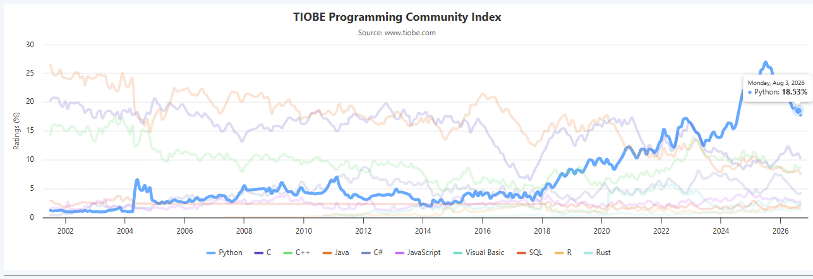
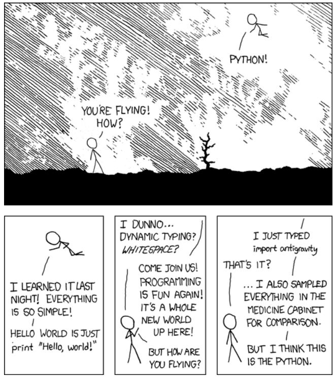

Python est aujourd'hui **l'un des langages de programmation les plus populaire au monde (selon [TIOBE](https://www.tiobe.com/tiobe-index/))**, et le langage dominant dans l'écosystème de la data science.



## Un peu d'histoire

Python a été créé par **Guido van Rossum** à la fin des années 1980[^1], et sa première version publique date de **1991**.[^2]

Guido van Rossum travaillait alors au CWI (*Centrum voor Wiskunde en Informatica*), à Amsterdam. En **décembre 1989**, pendant les vacances de Noël, l'entreprise était fermée et il cherchait un projet pour s'occuper. C'est ce qu'il appelle lui-même un **« side project »**, mené en marge de son travail officiel. Il raconte : *« J'avais deux semaines de vacances de Noël et rien à faire. »*[^3] En deux semaines, il écrit la première version de l'interpréteur Python.[^4]

Le nom **Python** ne vient pas du serpent 🐍, mais de la troupe de comédie britannique [**Monty Python**](https://fr.wikipedia.org/wiki/Monty_Python), que van Rossum appréciait. Il cherchait un nom **court, unique et légèrement mystérieux** et « Python » cochait toutes les cases.[^5]

::: {.callout-note}
## Le Zen de Python
Si vous tapez `import this` dans un interpréteur Python, vous verrez s'afficher le *Zen de Python*, une petite collection de 19 aphorismes qui résument la philosophie du langage. Par exemple :

> *« Beautiful is better than ugly. »*
> *« Simple is better than complex. »*
> *« Readability counts. »*

:::

## Les atouts de Python

### 1. Une syntaxe claire et lisible

Python a été conçu pour être **lisible**. Sa syntaxe utilise des mots-clés proches de l'anglais courant (`if`, `else`, `for`, `while`, `in`, `not`), et l'indentation fait partie intégrante de la grammaire du langage. Cela force à écrire du code structuré.

```python
# Calculer la moyenne de trois notes
notes = [12, 15, 8]
moyenne = sum(notes) / len(notes)
print("La moyenne est :", moyenne)
```

### 2. Un écosystème open-source très riche

C'est sans doute **l'argument le plus important** pour la data science. Python dispose d'une vaste collection de bibliothèques spécialisées, maintenues par une communauté active et **ouvertes** : on peut les utiliser, les modifier et les redistribuer librement.

Pour les retrouver, vous pouvez passer par l'index officiel [Pypi](https://pypi.org/) (Python Package Index), qui recense l'ensemble des paquets publiés pour Python. Vous pouvez également explorer [GitHub](https://github.com), où la grande majorité de ces bibliothèques sont développées en open source.

::: {.callout-warning}
L'écosystème open-source est une cible privilégiée pour les cyberattaques. Un phénomène de plus en plus répandu est la *supply chain attack* (attaque de chaîne d'approvisionnement) : des attaquants publient des paquets malveillants sur des dépôts officiels comme `PyPI`, ou compromettent des paquets légitimes en volant les identifiants de leurs mainteneurs.

Les techniques sont variées :

- Typosquatting : publication de paquets aux noms très proches de bibliothèques populaires (par exemple reqeusts au lieu de requests, ou nunpy au lieu de numpy) pour piéger les fautes de frappe.

- Compromission de mainteneurs : les attaquants volent les identifiants de développeurs légitimes et publient des versions malveillantes de paquets largement utilisés.

- Slopsquatting : exploitation des hallucinations des assistants IA, qui inventent parfois des noms de paquets inexistants. Les attaquants enregistrent ces noms pour piéger les développeurs qui installent aveuglément ce que l'IA a suggéré.

Les conséquences peuvent être graves : vol de données, installation de logiciels malveillants, compromission de l'ensemble d'une chaîne de *build*.

**Comment se protéger ?**

Vérifiez le nom exact avant d'installer un paquet. Une faute de frappe peut suffire.

Regardez les statistiques : un paquet légitime a généralement un historique, des étoiles, des contributeurs.

Préférez les paquets connus et largement utilisés quand c'est possible.

Soyez vigilant avec les suggestions de l'IA : un nom de paquet proposé par un assistant doit toujours être vérifié sur PyPI ou GitHub avant installation.
:::

| Domaine | Bibliothèques principales |
|---|---|
| Calcul numérique | **NumPy** |
| Manipulation de données | **Pandas**, Polars |
| Visualisation | **Matplotlib**, Seaborn, Plotly |
| Machine Learning | **scikit-learn** |
| Deep Learning | **PyTorch**, TensorFlow, JAX |
| Statistiques | SciPy, statsmodels |
| Web scraping | Beautiful Soup, Scrapy |
| Automatisation | **Airflow**, scheduler |

Ces bibliothèques sont **interopérables** : elles partagent souvent les mêmes structures de données (par exemple, `NumPy` est à la base de `Pandas`, `scikit-learn` et `PyTorch`). Cela permet d'enchaîner les étapes d'un projet sans friction : charger → nettoyer → analyser → visualiser → modéliser.


{width="50%" fig-align="center"}

## Apprendre Python à l'ère de l'IA générative ?

L'arrivée des assistants de code basés sur l'IA (GitHub Copilot, ChatGPT, Claude) a profondément transformé le paysage de l'apprentissage de la programmation. La question mérite d'être posée frontalement : **faut-il encore apprendre à coder quand une IA peut générer du code en quelques secondes ?**

La réponse, largement documentée par la recherche, est **oui biensûr, mais pour des raisons différentes qu'avant**.

### Le paradoxe de la productivité

Les études montrent que l'IA accélère considérablement l'écriture de code. Mais cette vitesse cache un risque pour les débutants : celui de **sauter l'étape de l'apprentissage**. Ce phénomène est appelé **« atrophie cognitive »**[^roxin] : à force de déléguer la syntaxe à l'IA, les apprenants développent une « façade syntaxique », ils produisent du code qui fonctionne, sans posséder les modèles mentaux pour en expliquer la logique ou en maintenir la structure.

Cette recherche introduit un concept essentiel pour comprendre l'enjeu : le **« Confidence-Competence Gap »** (écart entre confiance et compétence). Les développeurs novices qui utilisent l'IA produisent souvent du code de moindre qualité sécuritaire tout en se sentant plus confiants dans sa qualité. Le code fonctionne, mais l'apprenant n'a pas acquis les compétences sous-jacentes.

### Ce que disent les développeurs professionnels

L'enquête Stack Overflow 2025, menée auprès de plus de 49 000 développeurs, offre un éclairage précieux.[^stackoverflow] Les résultats révèlent une tension :

- **80 %** des développeurs utilisent des outils d'IA dans leur workflow
- Mais seulement **29 %** font confiance à leur exactitude (contre 40 % les années précédentes)
- **66 %** passent plus de temps à corriger du code généré par l'IA qui est « presque correct, mais pas tout à fait »
- **75 %** préfèrent demander de l'aide à un humain quand ils ne font pas confiance à l'IA

La frustration numéro un, citée par 66 % des développeurs, concerne les « solutions IA presque correctes mais pas tout à fait ». Cela signifie que **la compétence de vérification et de correction** devient plus critique que jamais.

### La question du « pourquoi » plutôt que du « comment »

Une enquête menée (Black, 2026) auprès de la communauté tech a posé directement la question : *« Si l'IA peut écrire du code, devons-nous encore apprendre à coder ? »*[^black]

**80,9 %** des répondants ont dit oui. Mais avec une nuance importante : *« oui, mais pas de la même manière »*. Le consensus émergent est que le rôle du développeur se déplace :

> « Le codage ne disparaît pas, il change. »

Les compétences qui gagnent en importance sont :

- **La pensée critique** : savoir si ce que l'IA a produit est correct, sûr, utile
- **La décomposition de problèmes** : savoir structurer un problème avant de demander à l'IA de le résoudre
- **La vérification** : auditer et contrôler la qualité du code généré
- **La pensée systémique** : comprendre comment les composants interagissent

### Le piège de l'illusion de compétence

Une étude sur les apprenants débutants (*The Widening Gap*, 2024) a observé que les étudiants qui utilisent l'IA de manière passive développent une **« illusion de compétence »** : le code fonctionne, donc ils pensent avoir compris. Mais quand on leur demande d'expliquer ou de modifier le code, ils échouent.[^widening]

À l'inverse, les apprenants qui réussissent utilisent l'IA comme **partenaire d'apprentissage**, pas comme substitut. Ils adoptent des stratégies comme :

- Demander des explications sur le code généré
- Décomposer les problèmes et n'utiliser l'IA que pour des parties spécifiques
- Résoudre manuellement d'abord, puis comparer avec la solution de l'IA


### Ce que cela signifie pour vous

Si vous débutez en programmation aujourd'hui :

1. **Apprenez les fondamentaux.** La syntaxe, les types, les boucles, les fonctions, ne vous inquiétez pas, ces concepts ne sont pas obsolètes. Ils sont la base sur laquelle vous construirez votre jugement.

2. **Utilisez l'IA, mais activement.** Demandez-lui des explications. Faites-lui vérifier votre code. Ne copiez-collez jamais sans comprendre.

3. **Développez votre esprit critique.** La compétence la plus valorisée à l'ère de l'IA n'est pas d'écrire du code, mais de **savoir si le code est correct**.

4. **Acceptez l'inconfort.** La « lutte productive », le moment où vous ne comprenez pas et devez chercher est précisément là où l'apprentissage se produit. L'IA peut réduire cet inconfort, mais si elle l'élimine complètement, elle élimine aussi l'apprentissage.

### Conclusion

L'IA ne rend pas l'apprentissage de la programmation obsolète. Elle le **recentre** sur ce qui compte vraiment : la capacité à résoudre des problèmes, à penser logiquement, et à porter un jugement critique sur ce que les machines produisent.


[^1]: [Python - Historique](https://leaderswithouttitle.github.io/PythonLWT/index.html)

[^2]: [Python Documentation officielle, *History of Python*](https://docs.python.org/3/faq/general.html#why-was-python-created-in-the-first-place)

[^3]: Guido van Rossum, cité dans *Linux Journal*, 1998. Voir aussi son blog personnel : [*The History of Python*](https://python-history.blogspot.com/).

[^4]: Computer History Museum, [*Oral History of Guido van Rossum*](https://computerhistory.org/profile/guido-van-rossum/).

[^5]: [Python FAQ — *Why is it called Python?*](https://docs.python.org/3/faq/general.html#why-is-it-called-python)

[^stackoverflow]: Stack Overflow Developer Survey (2025). [survey.stackoverflow.co](https://survey.stackoverflow.co/2025/)

[^black]: [Black, S. (2026). *The Question: Should We Still Learn to Code in the Age of AI?* IEEE Software.](https://ieeexplore-ieee-org.proxybib-pp.cnam.fr/stamp/stamp.jsp?arnumber=11679520&tag=1)

[^widening]: [*The Widening Gap: Novice Learners and Generative AI in Programming Education* (2024).](https://arxiv.org/abs/2405.17739)

[^roxin]: [IA générative : le risque de l’atrophie cognitive](https://www.polytechnique-insights.com/tribunes/neurosciences/ia-generative-le-risque-de-latrophie-cognitive/)