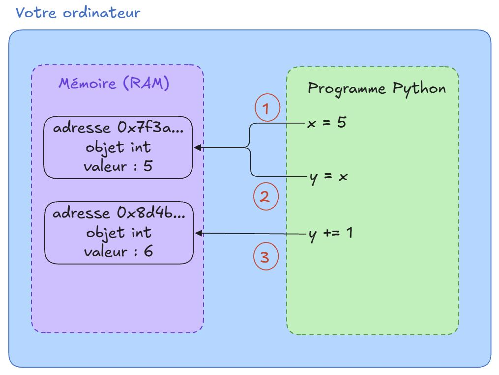
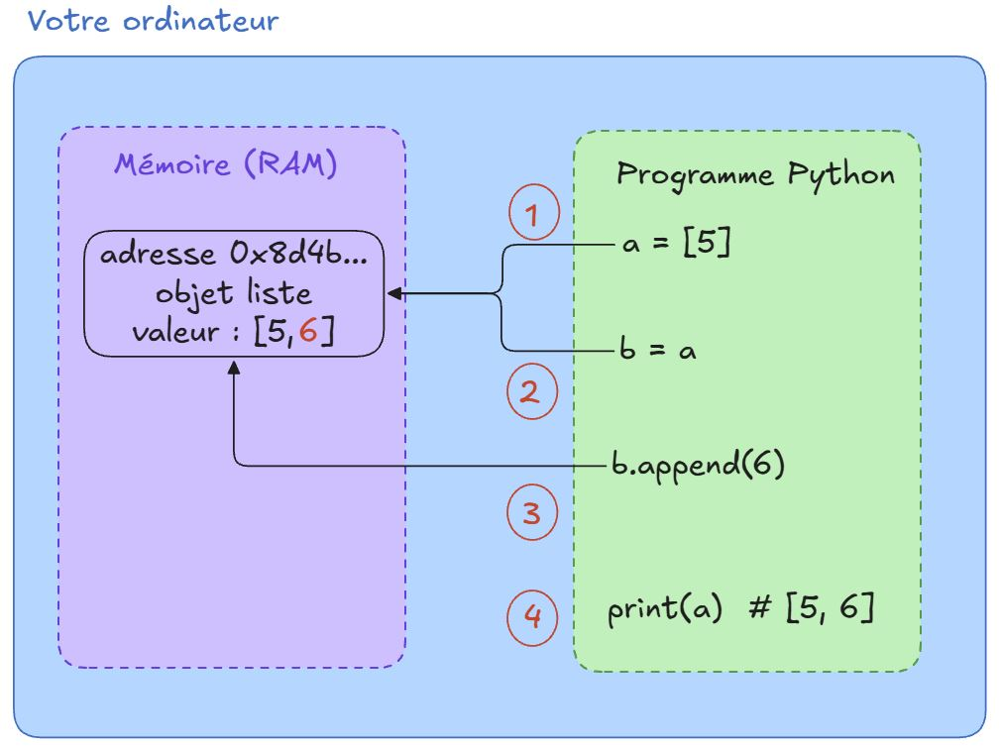

:::{.callout-tip}
Pour accéder aux notebooks d'exercices c'est ici 👇

[](https://colab.research.google.com/github/surybang/python_data/blob/main/notebooks/02-variables-types-operations.ipynb)
[](https://datalab.sspcloud.fr/launcher/ide/vscode-python?autoLaunch=true&name=%C2%AB01_premiers_pas%C2%BB&init.personalInit=%C2%ABhttps%3A%2F%2Fraw.githubusercontent.com%2Fsurybang%2Fpython_data%2Fmain%2Fscripts%2Finit.sh%C2%BB&init.personalInitArgs=%C2%AB02-variables-types-operations%C2%BB)
:::


## C'est quoi une **variable** ?

Une variable, c'est un **nom** qu'on associe à une valeur. Ce nom permet de retrouver la valeur plus tard dans le programme.

```python
age = 25            # age est un entier (int)
prenom = "Jessica"  # prenom est une chaine de caractère (str)
taille = 1.75       # taille est un flottant (float)
majeur = True       # majeur est un booléen (bool)
```

Ici, on a créé quatre variables :

- `age` désigne 25
- `prenom` désigne "Jessica"
- `taille` désigne 1.75
- `majeur` désigne True

::: {.callout-note}
### Le signe = n'est pas une égalité

En Python, `age = 25` ne veut pas dire « age est égal à 25 », mais « on associe le nom age à la valeur 25 ». C'est une **affectation**.

C'est pour ça que `x = x + 1` est parfaitement valide : on prend la valeur actuelle de x, on ajoute 1, et on associe le résultat au nom x.
:::

### Une variable est une étiquette, pas une boîte

On présente souvent une variable comme une boîte dans laquelle on range une valeur. C'est une image pratique pour débuter, mais elle est **fausse en Python**, et elle finit par provoquer des bugs difficiles à comprendre.

En réalité, une variable est une **étiquette** collée sur un objet stocké dans la mémoire de l'ordinateur (la RAM). Voici ce qui se passe concrètement 👇

{width=50%}

#### Étape 1 : `x = 5`

Python crée d'abord un objet de type `int` de valeur `5` quelque part dans la RAM, à une adresse donnée (ici `0x7f3a...`). Ensuite seulement, il associe le nom `x` à cette adresse.

Autrement dit, `x` ne contient pas `5` : `x` sait **où trouver** l'objet `5`.

```python
x = 5
print(id(x))  # l'adresse mémoire de l'objet désigné par x
```

#### Étape 2 : `y = x`

On pourrait penser que Python copie la valeur de `x` dans une nouvelle boîte `y`. Ce n'est pas le cas : **aucun nouvel objet n'est créé**. Le nom `y` reçoit simplement la même adresse que `x`.

On a donc deux étiquettes collées sur le même objet.

```python
y = x
print(id(x), id(y))  # les deux adresses sont identiques
print(x is y)        # True : x et y désignent le même objet
```

#### Étape 3 : `y += 1`

C'est l'étape clé. Les entiers sont **immuables** en Python : l'objet `5` ne peut pas être modifié. Python ne transforme donc pas le `5` en `6`. À la place, il :

1. lit la valeur de l'objet désigné par `y` (5) ;
2. calcule le résultat et crée **un nouvel objet** `6` à une autre adresse (ici `0x8d4b...`) ;
3. décolle l'étiquette `y` pour la recoller sur ce nouvel objet.

L'étiquette `x`, elle, n'a pas bougé : elle désigne toujours l'objet `5`.

```python
y += 1
print(x, y)          # 5 6
print(id(x), id(y))  # les adresses sont désormais différentes
print(x is y)        # False
```

::: {.callout-tip}
### À retenir
- Une variable est un **nom** qui désigne un objet en mémoire.
- `y = x` ne copie rien : les deux noms partagent le même objet.
- « Modifier » un `int`, un `float`, un `str` ou un `bool` crée toujours un **nouvel objet**, car ces types sont immuables.
:::

::: {.callout-important}
### 🧠 À vous de réfléchir : et avec une liste ?

Les listes, que nous verrons plus en détail plus tard, permettent de regrouper plusieurs valeurs. Observez le code suivant **sans l'exécuter** :

```python
a = [5]
b = a
b.append(6)   # ajoute 6 à la fin de la liste b
print(a)
```

1. Selon vous, qu'affiche `print(a)` ?
2. Dessinez, comme dans le schéma précédent, ce qui se passe en mémoire à chaque ligne.
3. Exécutez ensuite le code pour vérifier votre hypothèse.
:::

::: {.callout-tip collapse="true"}
### 💡 Voir la solution

```python
a = [5]
b = a
b.append(6)
print(a)  # [5, 6]
```

Surprise : `a` a été modifiée alors qu'on n'a touché qu'à `b` !

{width=50%}

Contrairement aux entiers, les listes sont **mutables** : elles peuvent être modifiées sur place.

- **Ligne 1** : Python crée un objet liste `[5]` en mémoire et lui colle l'étiquette `a`.
- **Ligne 2** : `b = a` ne copie rien, `b` est une deuxième étiquette sur **la même liste**.
- **Ligne 3** : `b.append(6)` ne crée pas de nouvel objet, il **modifie la liste existante**. Aucune étiquette ne bouge.
- **Ligne 4** : `a` désigne toujours cette même liste, qui contient maintenant `[5, 6]`.

C'est la différence clé avec l'exemple `y += 1` : avec un entier, Python crée un nouvel objet et recolle l'étiquette ; avec une liste, il modifie l'objet lui-même, et **toutes les étiquettes** qui le désignent « voient » le changement.

Pour obtenir une liste indépendante, il faut une copie explicite :

```python
a = [5]
b = a.copy()
b.append(6)
print(a)  # [5]
print(b)  # [5, 6]
```
:::


### Le typage dynamique

En `Python`, on ne déclare pas le type d'une variable. On écrit simplement `age = 25`, et l'interpréteur déduit le type à partir de la valeur.

```python
x = 5         # x est un entier (int)
x = "bonjour" # x est maintenant une chaîne (string)
x = 3.14      # x est maintenant un flottant (float)
```

Le type est attaché à la valeur et non pas à la variable. C'est logique : puisqu'une variable n'est qu'une étiquette, on peut la recoller sur un objet de n'importe quel type.

:::{.callout-warning}
### Une liberté qui a un prix

Le typage dynamique rend Python souple, mais il peut introduire des bugs silencieux. Une variable devrait avoir un rôle stable dans un programme.
:::


::: {.callout-note}
### Une nuance importante

Le discours « Python ne vérifie pas les types » est vrai **pour le langage lui-même**. L'interpréteur Python ignore les annotations de type : `x: int = "bonjour"` ne lève aucune erreur.

Mais certains **packages** s'appuient sur ces annotations pour ajouter une vérification à l'exécution. C'est le cas notamment de **Pydantic** (très utilisé en data science et dans les API), de **Typeguard** et de **Beartype**. Avec ces outils, une annotation devient une **contrainte réelle** : si la valeur ne respecte pas le type, une erreur est levée.

Donc : le type hint est un **indice** pour Python, mais il peut devenir une **règle** pour certaines bibliothèques.
:::


## Les types de base en Python

| Type | Nom Python | Exemples |
|---|---|---|
| Nombre entier | `int` | `42`, `-7`, `0` |
| Nombre à virgule | `float` | `3.14`, `-0.5`, `2.0` |
| Chaîne de caractères | `str` | `"bonjour"`, `'Alice'` |
| Booléen | `bool` | `True`, `False` |

On peut vérifier le type d'une variable avec la fonction `type()`

```python
age = 25
print(type(age))       # <class 'int'>

prenom = "Jessica"
print(type(prenom))    # <class 'str'>
```

## Opérations de base

Une fois qu'on sait nommer des valeurs, il faut pouvoir **les manipuler**. Python fournit des opérateurs pour calculer, assembler des chaînes ou comparer des valeurs.

### Opérations arithmétiques

Les opérateurs arithmétiques s'appliquent aux nombres (`int` et `float`).

| Opérateur | Signification | Exemple | Résultat |
|---|---|---|---|
| `+` | Addition | `7 + 3` | `10` |
| `-` | Soustraction | `7 - 3` | `4` |
| `*` | Multiplication | `7 * 3` | `21` |
| `/` | Division | `7 / 3` | `2.333...` |
| `//` | Division entière (quotient) | `7 // 3` | `2` |
| `%` | Modulo (reste) | `7 % 3` | `1` |
| `**` | Puissance | `7 ** 3` | `343` |

```python
a = 10
b = 3

print(a + b)   # 13
print(a - b)   # 7
print(a * b)   # 30
print(a / b)   # 3.3333333333333335
print(a // b)  # 3
print(a % b)   # 1
print(a ** b)  # 1000
```

::: {.callout-note}
### Division et division entière
En Python, `/` renvoie **toujours** un flottant, même quand le résultat tombe juste :

```python
print(10 / 2)   # 5.0 (et non 5)
print(10 // 2)  # 5
```
:::

### Les opérateurs d'affectation combinée

Modifier une variable à partir de sa propre valeur est si courant que Python propose des raccourcis (vous avez déjà croisé `y += 1` plus haut) :

| Raccourci | Équivaut à |
|---|---|
| `x += 1` | `x = x + 1` |
| `x -= 1` | `x = x - 1` |
| `x *= 2` | `x = x * 2` |
| `x /= 2` | `x = x / 2` |

```python
score = 10
score += 5
print(score)  # 15
```

### Priorité des opérations

Python respecte les règles de priorité habituelles des mathématiques :

1. Parenthèses `()`
2. Puissance `**`
3. Multiplication, division, division entière, modulo (`*`, `/`, `//`, `%`)
4. Addition, soustraction (`+`, `-`)

En cas de doute, **utilisez des parenthèses.** Elles ne coûtent rien et rendent le code plus lisible.

```python
print(2 + 3 * 4)      # 14 (et non 20)
print((2 + 3) * 4)    # 20
```

## Opérations sur les chaînes de caractères

```python
prenom = "Jessica"
nom = "Hyde"
```

### Concaténation et répétition

```python
nom_complet = prenom + " " + nom
print(nom_complet)   # Jessica Hyde

print("ha" * 3)      # hahaha
```

### Quelques outils utiles

| Outil | Rôle | Exemple | Résultat |
|---|---|---|---|
| `len()` | Longueur | `len("Python")` | `6` |
| `.upper()` | Majuscules | `"data".upper()` | `"DATA"` |
| `.lower()` | Minuscules | `"DATA".lower()` | `"data"` |
| `.capitalize()` | 1re lettre en majuscule | `"alice".capitalize()` | `"Alice"` |
| `.replace(a, b)` | Remplace a par b | `"chat".replace("c", "b")` | `"bhat"` |

::: {.callout-note}
### Une chaîne ne se modifie jamais
Comme les entiers, les `str` sont **immuables**. `.upper()` ne modifie pas la chaîne, elle en renvoie une **nouvelle**. Pour garder le résultat, il faut recoller l'étiquette :

```python
mot = "data"
mot.upper()
print(mot)        # data  → inchangé !
mot = mot.upper()
print(mot)        # DATA
```
:::

### Les f-strings : afficher des variables proprement

Plutôt que d'enchaîner les `+`, on préfixe la chaîne par `f` et on place les variables entre `{}` :

```python
age = 25
print(f"{prenom} a {age} ans")           # Jessica a 25 ans
print(f"Dans 10 ans : {age + 10} ans")   # calcul possible dans les {}
```

C'est la méthode recommandée en Python moderne.

### Contrôler l'affichage

Après la valeur, on peut ajouter `:` suivi d'un **code de formatage** :

| Code | Effet | Exemple | Résultat |
|---|---|---|---|
| `.2f` | 2 décimales | `f"{3.14159:.2f}"` | `3.14` |
| `.1%` | pourcentage, 1 décimale | `f"{0.857:.1%}"` | `85.7%` |
| `,` | séparateur de milliers | `f"{1234567:,}"` | `1,234,567` |
| `_.2f` | séparateur `_` et 2 décimales | `f"{1234567:_.2f}"` | `1_234_567.00` |
| `>10` | aligné à droite sur 10 caractères | `f"{42:>10}"` | `        42` |
| `<10` | aligné à gauche sur 10 caractères | `f"{42:<10}"` | `42        ` |
| `010` | complété avec des zéros | `f"{42:010}"` | `0000000042` |

On peut combiner les codes : `f"{1482300.5:,.2f}"` donne `1,482,300.50`.

::: {.callout-note collapse="true"}
### Les différentes façons de formater en Python

Python a connu trois générations de formatage. Vous les croiserez toutes dans du code existant.

**1. Opérateur `%` (style C, Python 2)**

```python
"Bonjour %s, tu as %d ans" % ("Alice", 25)
"Prix : %.2f€" % 3.14159
```

`%s` → chaîne, `%d` → entier, `%f` → flottant. Encore très présent dans du code *legacy*.

**2. `.format()` (Python 3.0)**

```python
"Bonjour {}, tu as {} ans".format("Alice", 25)
"Prix : {:.2f}€".format(3.14159)
"{prenom} a {age} ans".format(prenom="Alice", age=25)
```

Plus lisible que `%`, mais verbeux.

**3. f-strings (Python 3.6)**

```python
prenom, age = "Alice", 25
f"Bonjour {prenom}, tu as {age} ans"
f"Prix : {3.14159:.2f}€"
```

Le code s'écrit directement dans la chaîne. C'est ce qu'on utilise aujourd'hui.

**Les trois font la même chose :**

```python
prenom = "Alice"
prix = 3.14159

print("Bonjour %s, prix : %.2f€" % (prenom, prix))
print("Bonjour {}, prix : {:.2f}€".format(prenom, prix))
print(f"Bonjour {prenom}, prix : {prix:.2f}€")
# Bonjour Alice, prix : 3.14€  (trois fois)
```

Remarquez que le code `.2f` est le même partout : ce que vous apprenez avec les f-strings reste valable pour lire l'ancien code.
:::

## Conversions de types

Python ne mélange pas les types automatiquement :

```python
age = 25
print("J'ai " + age + " ans")  # ❌ TypeError
```

Il faut **convertir** explicitement :

| Fonction | Convertit en | Exemple | Résultat |
|---|---|---|---|
| `str()` | chaîne | `str(25)` | `"25"` |
| `int()` | entier | `int("25")` | `25` |
| `float()` | flottant | `float("1.75")` | `1.75` |
| `bool()` | booléen | `bool(0)` | `False` |

```python
print("J'ai " + str(age) + " ans")  # 🆗 J'ai 25 ans
```

::: {.callout-tip}
### Vrai ou faux ?
`bool()` renvoie `False` pour les valeurs « vides » : `0`, `0.0`, `""` (chaîne vide). Tout le reste vaut `True`, même `-42` ou `"False"`.
:::

::: {.callout-warning}
`int("bonjour")` lève une `ValueError` : on ne peut convertir que ce qui a du sens. Cas fréquent en data : des nombres stockés en texte dans un CSV, à convertir avant de calculer.
:::

## Opérations de comparaison

Les opérateurs de comparaison renvoient un booléen (`True` ou `False`).

| Opérateur | Signification | Exemple | Résultat |
|---|---|---|---|
| `==` | Égal à | `5 == 5` | `True` |
| `!=` | Différent de | `5 != 3` | `True` |
| `<` | Inférieur à | `5 < 3` | `False` |
| `>` | Supérieur à | `5 > 3` | `True` |
| `<=` | Inférieur ou égal | `5 <= 5` | `True` |
| `>=` | Supérieur ou égal | `5 >= 6` | `False` |


```python
print(5 == 5)     # True
print(5 != 3)     # True
print(10 > 3)     # True
print(10 <= 3)    # False
```
